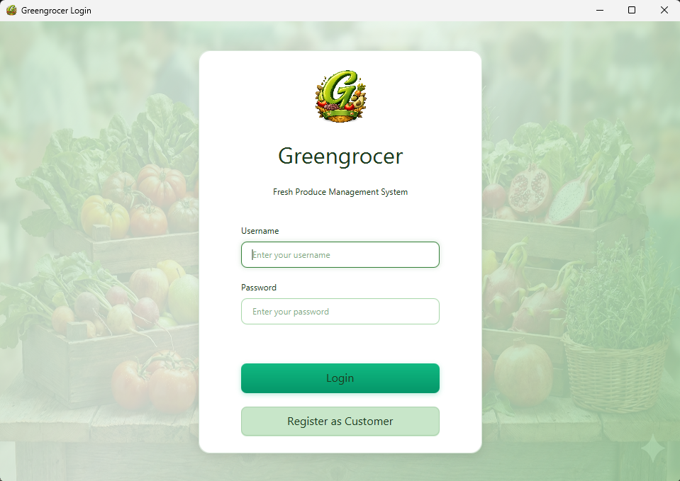

<div align="center">

# 🥬 Greengrocer Java App

### A Full-Featured Grocery Store Management Platform

**Built with JavaFX · Powered by MySQL · Cross-Platform Ready**

[](https://www.oracle.com/java/technologies/downloads/#java21)
[](https://openjfx.io)
[](https://www.mysql.com)
[](LICENSE)
[](.)

</div>

---

## 📖 About

Greengrocer Java App is a full-stack desktop application for managing a grocery store. It supports three different user roles — **Customer**, **Owner**, and **Carrier** — each with their own dedicated dashboard. The entire system is connected through a shared cloud-hosted MySQL database, so there is no need for any local database installation.

The application features real-time inventory management, order processing with delivery tracking, a loyalty rewards system (G-Points), discount coupons, PDF invoice generation, a built-in messaging system, and detailed sales analytics — all wrapped in a modern dark-themed UI.

---

## 📸 Screenshots

<!-- 
  Add your screenshots here. Place image files in a /screenshots folder and reference them like:
  
-->

| Login Screen | Customer Dashboard | Owner Panel |
|:---:|:---:|:---:|
| *Coming soon* | *Coming soon* | *Coming soon* |

---

## 🚀 Setup Guide

Follow the steps below to get the application running on your machine. The instructions are provided separately for **Windows** and **macOS**.

---

### Step 1: Install JDK 21

The only software you need to install is **JDK (Java Development Kit) version 21** or higher.

<details>
<summary><b>🪟 Windows</b></summary>

1. Go to the [Oracle JDK 21 Downloads](https://www.oracle.com/java/technologies/downloads/#java21) page
2. Under the **Windows** tab, download the **x64 Installer** (`.exe` file)
3. Run the downloaded `.exe` file
4. Follow the installer steps — click **Next** through each screen and then **Close** when finished
5. Verify the installation by opening **Command Prompt** (`Win + R` → type `cmd` → Enter) and running:
   ```
   java -version
   ```
   You should see output containing `java version "21.x.x"` or similar.

</details>

<details>
<summary><b>🍎 macOS</b></summary>

**Option A: Using Homebrew (Recommended)**
```bash
brew install openjdk@21
```

**Option B: Manual Installation**
1. Go to the [Oracle JDK 21 Downloads](https://www.oracle.com/java/technologies/downloads/#java21) page
2. Under the **macOS** tab, download the appropriate installer:
   - **ARM64 DMG Installer** → for Apple Silicon Macs (M1, M2, M3, M4)
   - **x64 DMG Installer** → for Intel Macs
3. Open the downloaded `.dmg` file
4. Double-click the `.pkg` installer inside and follow the on-screen instructions
5. Verify the installation by opening **Terminal** and running:
   ```bash
   java -version
   ```
   You should see output containing `java version "21.x.x"` or similar.

</details>

---

### Step 2: Download the Project

1. Go to the [GitHub repository page](https://github.com/KeremIrfanoglu/Greengrocer-Java-App)
2. Click the green **"<> Code"** button
3. Select **"Download ZIP"**
4. Once downloaded, **extract the ZIP file** to a location of your choice (e.g., Desktop)

You should now have a folder named `Greengrocer-Java-App-main` (or similar) containing the project files.

---

### Step 3: Database Configuration

> ⚠️ **Important:** The database credentials (`db.properties`) are **not included** in this repository for security reasons.

**To request the `db.properties` file, contact me via:**

- 📧 **Email:** keremirfanoglu1@gmail.com
- 💬 **GitHub Issues:** [Open an issue](https://github.com/KeremIrfanoglu/Greengrocer-Java-App/issues) on the repository

Once you receive the file, place `db.properties` in the **root directory** of the project — the same folder where `pom.xml`, `run.bat`, and `run.sh` are located:

```
Greengrocer-Java-App/
├── db.properties       ← Place it here
├── pom.xml
├── run.bat
├── run.sh
├── src/
└── ...
```

---

### Step 4: Run the Application

<details>
<summary><b>🪟 Windows</b></summary>

Simply **double-click** `run.bat` in the project folder.

That's it! The script will automatically detect your JDK installation and launch the application.

> 💡 If Windows shows a **"Windows protected your PC"** warning, click **"More info"** → **"Run anyway"**.

</details>

<details>
<summary><b>🍎 macOS</b></summary>

1. Open **Terminal** (you can find it via Spotlight: `Cmd + Space` → type "Terminal")

2. Navigate to the project folder. For example, if you extracted it to your Desktop:
   ```bash
   cd ~/Desktop/Greengrocer-Java-App-main
   ```

3. Grant execution permission to the scripts *(only needed once)*:
   ```bash
   chmod +x run.sh mvnw
   ```

4. Run the application:
   ```bash
   ./run.sh
   ```

> 💡 The script will automatically detect your JDK installation and launch the application.

</details>

> **📝 First Launch:** The first run takes approximately **1–2 minutes** as Maven automatically downloads the required libraries. All subsequent launches will be much faster.

---

### Step 5: Create an Account & Login

**Create your own account:**

1. On the login screen, click **"Sign Up"**
2. Fill in your details and choose **Customer** as the role
3. Click **Register** — you can now log in with your new credentials

**Or use the test accounts below:**

| Role | Username | Password | Description |
|------|----------|----------|-------------|
| 🏪 Owner | `own` | `own` | Full admin access — manage products, orders, carriers |
| 👤 Customer | `cust` | `cust` | Browse products, place orders, earn rewards |
| 🚚 Carrier | `carr` | `carr` | View and manage delivery assignments |

<details>
<summary><b>Additional test accounts</b></summary>

| Role | Username | Password |
|------|----------|----------|
| 👤 Customer | `john` | `123456` |
| 👤 Customer | `emily` | `123456` |
| 🚚 Carrier | `carrier1` | `123456` |
| 🚚 Carrier | `carrier2` | `123456` |

</details>

---

## ✨ Features

### 👤 Customer Panel
- 🛒 Browse products by category with real-time stock & pricing
- 🛍️ Add to cart, adjust quantities, and place orders
- ⭐ Favorite products for quick access
- 💰 Earn & spend **G-Points** (loyalty rewards system)
- 🎟️ Apply discount coupons at checkout
- 📄 Download **PDF invoices** for completed orders
- 💬 Built-in messaging with the store owner
- 📊 View personal order history and spending analytics

### 🏪 Owner Panel
- 📦 Full product management — add, edit, and delete products with images
- 🖼️ Upload product images (auto-compressed for performance)
- 📊 Sales analytics with revenue charts and profit/loss tracking
- 🚚 Assign carriers to pending orders
- 👥 Manage carriers and supplier records
- 🎟️ Create and distribute discount coupons
- 💬 Messaging system with customers and carriers
- 📈 Inventory tracking with **low-stock alerts**

### 🚚 Carrier Panel
- 📋 View and accept delivery assignments
- 🔄 Update delivery status in real-time
- ⭐ View customer ratings and feedback
- 💬 Communicate with the owner
- 📊 Track delivery history and performance metrics

---

## 🔧 Technical Highlights

| Feature | Description |
|---------|-------------|
| ☁️ **Cloud Database** | MySQL hosted on Railway — no local database installation required |
| 🔐 **Password Security** | All passwords are stored with salted SHA-256 hashing |
| 🖥️ **Cross-Platform** | Runs on Windows, macOS, and Linux with automatic JDK detection |
| �️ **Smart Image Handling** | Product images can be uploaded through the app and are automatically resized and compressed for optimal performance |
| 📄 **PDF Generation** | Professional invoices generated with OpenPDF |
| 🏗️ **MVC Architecture** | Clean separation of concerns with DAO pattern for database operations |

---

## 🛠️ Tech Stack

| Layer | Technology |
|-------|-----------|
| **Language** | Java 21 |
| **UI Framework** | JavaFX 21 (FXML + CSS) |
| **Database** | MySQL 8.0 (Cloud — Railway) |
| **PDF Generation** | OpenPDF 2.0 |
| **Build Tool** | Apache Maven (via included wrapper — no installation needed) |
| **Architecture** | MVC + DAO Pattern |

---

## 🏗️ Architecture

```
┌─────────────────────────────────────────────────────┐
│                    Presentation Layer                │
│            JavaFX UI (FXML Views + CSS)             │
├─────────────────────────────────────────────────────┤
│                    Controller Layer                  │
│    CustomerController · OwnerController · Carrier   │
│    LoginController · RegisterController             │
├─────────────────────────────────────────────────────┤
│                  Data Access Layer (DAO)             │
│   ProductDAO · OrderDAO · UserDAO · CartDAO · ...   │
├─────────────────────────────────────────────────────┤
│                   Database Adapter                   │
│               JDBC · Connection Pooling             │
├─────────────────────────────────────────────────────┤
│                  MySQL Database (Cloud)              │
│                   Railway Platform                   │
└─────────────────────────────────────────────────────┘
```

---

## 📁 Project Structure

```
Greengrocer-Java-App/
│
├── src/main/java/com/greengrocer/
│   ├── Main.java                       # Application entry point
│   │
│   ├── controllers/                    # UI Controllers (MVC)
│   │   ├── CustomerController.java     # Customer dashboard & shopping
│   │   ├── OwnerController.java        # Admin panel & store management
│   │   ├── CarrierController.java      # Delivery management
│   │   ├── LoginController.java        # Authentication
│   │   └── RegisterController.java     # New user registration
│   │
│   ├── dao/                            # Data Access Objects
│   │   ├── DatabaseAdapter.java        # Database connection manager
│   │   ├── ProductDAO.java             # Product CRUD + lazy image loading
│   │   ├── OrderDAO.java               # Order processing & history
│   │   ├── UserDAO.java                # User management & authentication
│   │   ├── CartDAO.java                # Shopping cart operations
│   │   ├── FavoritesDAO.java           # Customer favorites
│   │   └── ...                         # Reports, Coupons, etc.
│   │
│   ├── models/                         # Data Models
│   │   ├── Product.java                # Product with image caching
│   │   ├── User.java                   # User entity
│   │   ├── Order.java                  # Order entity
│   │   ├── CartItem.java               # Shopping cart item
│   │   └── ...                         # Supplier, Coupon, etc.
│   │
│   ├── util/                           # Utilities
│   │   ├── ImageCompressor.java        # Auto image compression (500×500)
│   │   ├── InvoiceGenerator.java       # PDF invoice generation
│   │   ├── PasswordUtils.java          # Secure password hashing
│   │   ├── StyleHelper.java            # UI theming & styling
│   │   └── StyledAlert.java            # Custom styled dialogs
│   │
│   └── setup/                          # Database Setup
│       ├── SetupDatabase.java          # Creates tables & schema
│       └── SeedData.java               # Populates initial test data
│
├── src/main/resources/com/greengrocer/
│   ├── views/                          # FXML layout files
│   │   ├── login.fxml
│   │   ├── register.fxml
│   │   ├── customer.fxml
│   │   ├── owner.fxml
│   │   └── carrier.fxml
│   └── views/styles.css                # Application stylesheet
│
├── pom.xml                             # Maven build configuration
├── run.bat                             # Windows launcher (auto-detects JDK)
├── run.sh                              # macOS/Linux launcher (auto-detects JDK)
├── mvnw / mvnw.cmd                     # Maven wrapper (no Maven install needed)
└── db.properties.example               # Database config template
```

---

## 📄 License

This project is licensed under the [MIT License](LICENSE).

```
MIT License — Copyright (c) 2025 Kerem İrfanoğlu

Permission is hereby granted, free of charge, to any person obtaining a copy of this 
software to use, copy, modify, merge, publish, distribute, sublicense, and/or sell 
copies, subject to the following conditions: the above copyright notice shall be 
included in all copies. The software is provided "as is", without warranty of any kind.
```
